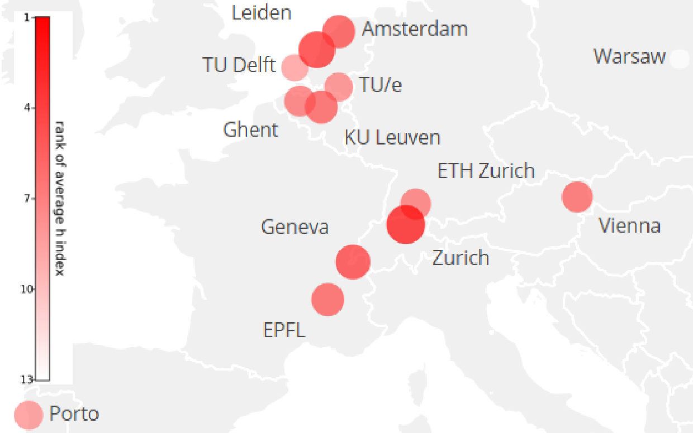

# Node Analysis for Academic Networks
+ Proposed a performance metric *cite ratio* for evaluating influence of authors in academic networks
+ Retrieved comprehensive information of scholars among 5 major fields and 77 academic institutions concerning h-index and paper citations for derivation of *cite ratio*
+ Visualized *cite ratio* distributions and *kernel density estimations* to analyze similarities and differences between more influential fields/institutions and less influential ones. Superiority of academic status is reflected by and strongly related to a higher average/median *cite ratio*
+ Established a standardized publication and citation model for deriving the conclusion that *cite ratio* of an arbitrary author is inversely correlated to his h-index

---
Data (h-index and annual citations) of all scholars are retrieved from [Google Scholar](https://scholar.google.com). All investigated academic institutions are listed below:

### North America:

1. Massachusetts Institute of Technology
2. Stanford University
3. Harvard University
4. California Institute of Technology
5. Princeton University
6. Cornell University
7. Yale University
8. John Hopkins University
9. Columbia University
10. University of Pennsylvania
11. Duke University
12. University of California Berkeley
13. Northwestern University
14. University of Toronto
15. McGill University
16. University of California Los Angeles
17. University of California San Diego
18. Carnegie Mellon University
19. University of British Columbia
20. New York University
21. Brown University
22. University of Washington
23. University of Texas at Austin
24. University of Illinois at Urbana Champaign
25. Georgia Institute of Technology
26. University of North Carolina at Chapel Hill
27. Ohio State University
28. Rice University
29. University of Alberta
30. Purdue University
31. University of Montreal
32. University of California Santa Barbara
33. McMaster University
34. University of Waterloo
35. University of Illinois at Chicago
36. University of Western Ontario
37. University of Calgary
38. Simon Fraser University
39. University of Ottawa
40. State University of New York at Stony Brook
41. University of Saskatchewan

### Europe:

1. ETH Zurich
2. Swiss Federal Institute of Technology in Lausanne
3. Delft University of Technology
4. University of Amsterdam
5. University of Leuven
6. University of Zurich
7. University of Geneva
8. Eindhoven University of Technology
9. Leiden University
10. Ghent University
11. University of Vienna
12. University of Porto
13. University of Warsaw

### Asia:

1. Nanyang Institute of Technology
2. National University of Singapore
3. Tsinghua University
4. University of Hong Kong
5. University of Tokyo
6. Hong Kong University of Science and Technology
7. Kyoto University
8. Seoul National University
9. Peking University
10. Fudan University
11. Chinese University of Hong Kong
12. City University of Hong Kong
13. Shanghai Jiao Tong University
14. Osaka University
15. National Taiwan University
16. Zhejiang University
17. Korea University
18. Hong Kong Polytech University
19. University of Science and Technology of China
20. Nanjing University
21. Sun Yat Sen University
22. Xi’an Jiaotong University
23. Huazhong University of Science and Technology